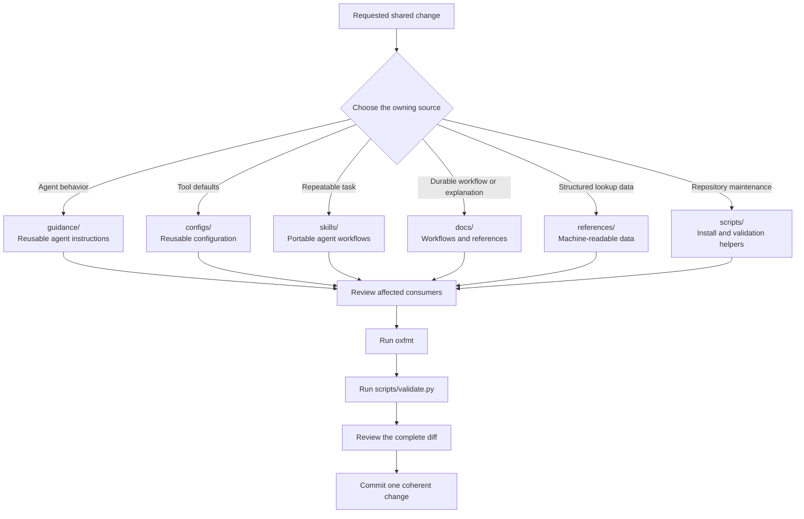
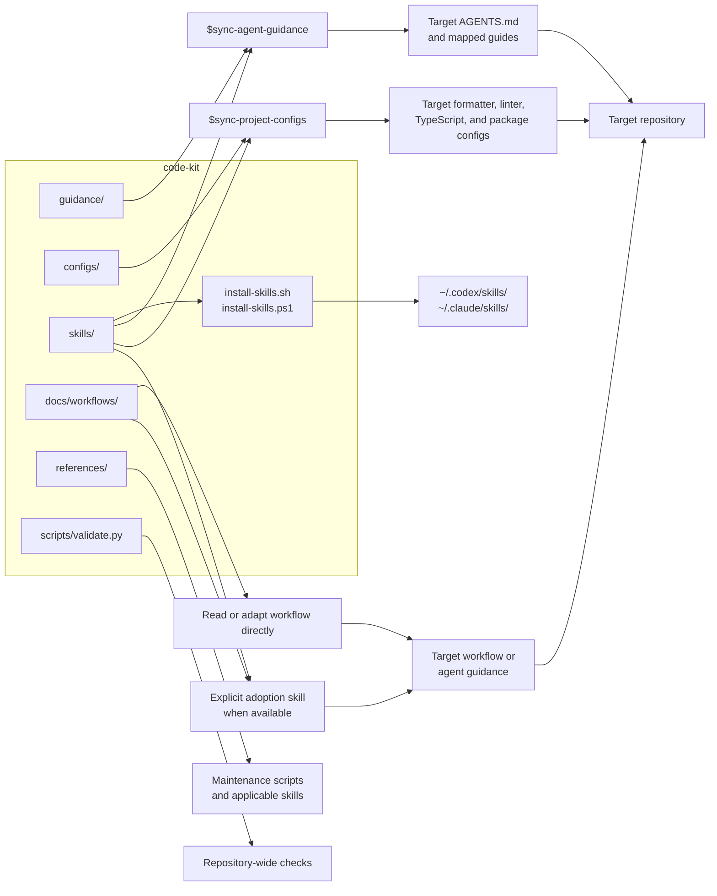

# Repository Flow

This document shows how code-kit is maintained and how other repositories consume it. Code-kit is a source repository for shared resources. It is not a runtime dependency of target projects.

## Maintenance Flow

Choose one canonical home for each rule or resource. Update related files only when they consume, index, describe, or validate that source.

## Downstream Consumption

Installation exposes skills to an agent runtime. It does not apply them to a project. A user must invoke task-oriented skills explicitly.

Workflows can be read or adapted directly. Add an adoption skill only after its adoption behavior is defined and repeatable.

Synchronization and adoption inspect the target first. They adapt shared behavior to local ownership, language, tooling, and workflow conventions. They keep project-specific rules until those rules have been evaluated.

Changes do not propagate automatically. Run the relevant audit or synchronization skill when a target repository needs current guidance or configuration.

Private guidance under `guidance/private/` stays local. Do not publish or copy it unless the user explicitly requests that action.
