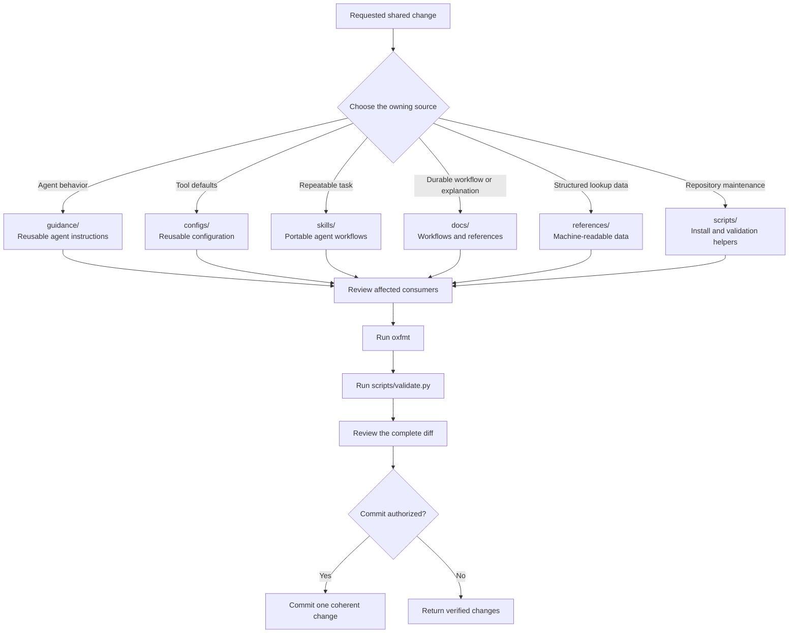
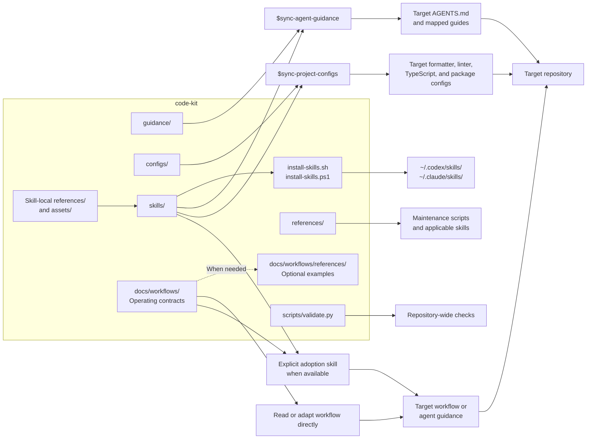

# Repository Flow

This document shows how code-kit is maintained and how other repositories consume it. Code-kit is a source repository for shared resources. It is not a runtime dependency of target projects.

## Maintenance Flow

Choose one canonical home for each rule or resource. Update related files only when they consume, index, describe, or validate that source. A request to edit shared resources does not by itself require a commit.

For substantial workflow changes, exercise representative request scenarios before handoff: a narrow edit, a read-only audit, an authorized implementation with verification, and a case needing a new decision. Check scope preservation and observable completion rather than matching prose or headings.

## Downstream Consumption

Installation exposes skills to an agent runtime. It does not apply them to a project. A user must invoke task-oriented skills explicitly.

Workflows can be read or adapted directly. Add an adoption skill only after its adoption behavior is defined and repeatable.

Synchronization and adoption inspect relevant target evidence first. They adapt shared behavior to local ownership, language, tooling, and workflow conventions. Missing generic advice or omitted source sections do not establish drift; retain instructions that affect likely decisions or protect concrete constraints.

Guidance synchronization defaults to one `AGENTS.md` at the owning project root, not one per source folder or build target. Nested guidance needs an explicit placement request or materially different subtree rules that cannot be kept clear at the root. A solution directory with a same-named inner C++ source directory normally remains one guidance scope; see [repository placement guidance](../guidance/Repositories.md#guidance-shape).

Source language guides share a consistent layout and link to canonical readability and local-consistency rules in `guidance/AGENTS.md`. Guidance synchronization keeps one applicable copy of those rules in the target and updates links; standalone exports include the required rules when the shared entrypoint will not accompany them.

Workflow documents own compact operating contracts; their examples and rationale live under `docs/workflows/references/` and are read only for a relevant question. Skills route to these contracts and conditional skill-local resources instead of duplicating every rule. Existing compatible supporting methods do not require loading all linked workflows.

Installers link complete skill directories. Keep the source checkout available because adoption and sync skills resolve shared `docs/`, `guidance/`, or `configs/` through their real paths. Standalone copies must include skill-local references and assets and may need user-supplied shared-source paths.

Changes do not propagate automatically. Run the relevant audit or synchronization skill when a target repository needs current guidance or configuration.

Private guidance under `guidance/private/` stays local. Do not publish or copy it unless the user explicitly requests that action.
