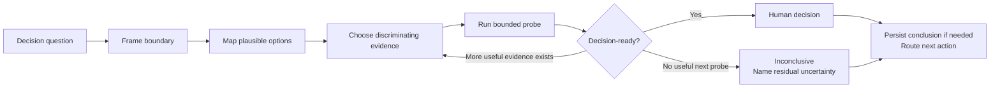

# EvidenceProbe

> An agent-native method for resolving consequential uncertainty with bounded evidence.
>
> Version 0.1.0
>
> Status: Draft

EvidenceProbe helps a human owner make a consequential product, technical, or operational decision when material uncertainty blocks direction or safe implementation.

It seeks the smallest trustworthy evidence that can change or support the decision. It ends with decision-ready evidence or an explicit inconclusive result, not production integration.

## Scope

EvidenceProbe is designed first for one decision owner working with one primary agent and optional specialist agents.

It can operate independently, resolve a decision that blocks [OutcomeFlow](./outcome-flow.md) selection or reconsideration, or investigate material uncertainty discovered during [ChangeShape](./change-shape.md).

## Non-Goals

EvidenceProbe is not:

- a general research archive
- a replacement for human product or technical authority
- an exhaustive proof process
- a production implementation method
- a reason to prototype when existing evidence is sufficient
- a scoring model for decisions
- a mandatory architecture or review ceremony

## Why EvidenceProbe

When agents produce research summaries, comparisons, benchmarks, and prototypes quickly, they can create more plausible material than a human owner can validate or use.

EvidenceProbe instead focuses on constraints that can remain scarce:

- decision attention
- trustworthy and relevant evidence
- access to faithful environments and data
- the cost of validating generated claims
- accountability for consequences

EvidenceProbe bounds investigation around one decision. It values evidence that discriminates between plausible options over evidence volume, research duration, or artifact count.

## Principles

1. **Frame the decision before investigating.** Research must serve a concrete choice or action.
2. **Keep decision authority with the human owner.** Agents gather, challenge, and explain evidence; they do not silently establish product meaning or accept consequential risk.
3. **Use the smallest discriminating probe.** Prefer the lowest-cost trustworthy evidence that could change the decision.
4. **Inspect existing evidence first.** Do not create a prototype when repository behavior, operational data, or authoritative documentation already answers the question.
5. **Compare real alternatives.** Include only plausible options or hypotheses and avoid false balance.
6. **Report observed evidence.** Distinguish what was inspected, measured, tested, inferred, or left unresolved.
7. **Keep probes disposable.** A prototype or benchmark is evidence, not production implementation.
8. **Name residual uncertainty.** Do not turn missing evidence into reassuring language or false precision.
9. **Stop when the decision is ready.** Do not continue gathering evidence that cannot reasonably change the action.
10. **Persist only consequential conclusions.** Keep transient research in the interaction and durable decisions in their canonical home.

## Operating Question

Ask:

> What is the smallest trustworthy evidence that would let the human owner make this decision or show that it cannot yet be made?

## Entry and Exit Contract

Enter EvidenceProbe only when one consequential Decision Question, its human Decision Owner, and the action blocked by uncertainty can be identified. If the owner can answer the question directly or no practical evidence could change the action, do not manufacture a Probe.

Exit with:

- the bounded Probe that was run
- material claims marked `supported`, `contradicted`, or `unresolved`
- an overall result of `decision-ready` or `inconclusive`
- residual uncertainty and its consequence
- the explicit choice returned to the human owner

The result may inform OutcomeFlow or ChangeShape, but it never counts as production implementation.

## Operating Loop



The decision boundary, not a fixed time interval, determines the size of the investigation.

## Core Concepts

### Decision Question

A Decision Question states the consequential choice or uncertainty and the action it blocks.

Good questions distinguish an action:

- Can the current storage model support offline synchronization without data loss?
- Which authentication approach satisfies the product and recovery constraints?
- Is the rendering bottleneck caused by data preparation or browser layout?

Avoid broad prompts such as `research authentication` or `investigate performance`.

### Decision Owner

The Decision Owner has authority to accept the conclusion, residual uncertainty, and consequences.

The primary agent coordinates evidence gathering. Specialist agents may investigate independent evidence sources when the owner and primary agent can review the results.

### Decision Boundary

The Decision Boundary keeps the probe finite. Define only what affects the decision:

- included and excluded questions
- plausible options or hypotheses
- important constraints
- consequences of a wrong decision
- acceptable residual uncertainty
- conditions that stop or reframe the probe

### Discriminating Evidence

Discriminating Evidence distinguishes between plausible options or explanations by supporting or contradicting their material claims.

Evidence that is interesting but cannot affect the decision is out of scope.

### Probe

A Probe is the smallest bounded action that can obtain discriminating evidence.

Typical probes include:

- inspecting existing code, configuration, or history
- reproducing behavior in a faithful environment
- running a targeted benchmark or measurement
- querying operational or product data
- comparing primary documentation or standards
- building a disposable prototype or simulation
- obtaining focused user, stakeholder, or domain-expert input

## When to Use EvidenceProbe

Use EvidenceProbe when:

- two or more reasonable options would lead to materially different actions
- feasibility, compatibility, or system behavior is uncertain
- a costly-to-reverse decision lacks sufficient evidence
- ChangeShape reveals product or technical ambiguity that must be resolved before implementation
- OutcomeFlow selection or reconsideration depends on a consequential decision

Do not use it when:

- one conventional and inexpensive-to-reverse approach is already clear
- the decision owner can answer a product preference directly
- production implementation is the remaining work; use ChangeShape
- a live service requires immediate containment or restoration
- the investigation is curiosity without a decision or action

## Evidence Design

Choose evidence in the order that best fits the decision, not from a mandatory hierarchy.

Prefer:

- existing behavior over speculation
- primary sources over summaries
- the actual target environment over an unrealistic substitute
- direct measurements over proxy metrics
- one discriminating comparison over a broad survey
- reproducible observations over unexplained conclusions

Use external sources only when repository and system evidence cannot answer the question. Link the sources used and distinguish source claims from your own inference.

Report commands as run, environments as observed, and material limitations. Do not claim that an unrun test, inaccessible system, or expected result is evidence.

## Evidence States

Label material claims with one of these states:

- `supported`: observed evidence makes the claim reasonable for the current decision
- `contradicted`: observed evidence conflicts with the claim
- `unresolved`: available evidence does not support a responsible conclusion

These states are qualitative. Do not total scores, assign confidence percentages without a valid model, or count sources as votes.

The overall probe ends as:

- `decision-ready`: the human owner has enough evidence to choose while understanding remaining uncertainty
- `inconclusive`: no useful Probe remains within the Decision Boundary, or necessary evidence is unavailable; state what remains unknown and why it matters

An inconclusive result blocks a costly-to-reverse production commitment by default. The human owner may proceed only after explicitly accepting the named uncertainty and consequence. That choice does not relabel the evidence as decision-ready.

## Prototypes and Experimental Artifacts

Keep prototypes isolated from production paths and clearly identify them as disposable evidence.

Do not:

- silently turn a prototype into production implementation
- weaken production safety or quality requirements because the probe appears promising
- preserve generated experiments as a permanent alternative code path without a selected Outcome
- mutate production systems unless the user explicitly authorized that probe and its recovery plan

When the owner selects an approach, route the production change through ChangeShape. Reuse findings intentionally, but do not treat prototype quality as accepted implementation quality.

## Interaction Protocol

Invoke `$run-evidence-probe` to apply this protocol to one consequential uncertainty.

1. Inspect enough existing context to determine whether a probe is justified.
2. Announce the Decision Question and why existing evidence is insufficient in one concise line.
3. Identify the Decision Owner and the action blocked by uncertainty.
4. Establish the Decision Boundary, plausible options or hypotheses, consequences, and stop conditions.
5. Select the smallest discriminating Probe. State what result would change the decision before running it.
6. Run the Probe and report evidence actually observed.
7. Mark material claims as `supported`, `contradicted`, or `unresolved`.
8. Stop when the evidence is decision-ready. Run another Probe only when it can reasonably change the action.
9. Let the human owner decide or explicitly accept residual uncertainty.
10. Route any implementation through ChangeShape and any product-level reconsideration through OutcomeFlow.
11. Remove disposable coordination and experimental artifacts unless the user asks to retain them or they become durable evidence in their native system.

## Decision Record

Keep the decision and evidence observable during the active interaction. Persist them only when the rationale must remain understandable after the interaction.

Use the repository's existing decision-record convention when one exists. A minimal durable record contains only:

```markdown
# Decision

## Context

The decision and why it matters.

## Evidence

The observations that materially affected the choice.

## Choice

The human owner's choice.

## Consequences

Important tradeoffs, residual uncertainty, and any reconsideration trigger.
```

Do not create research journals, source dumps, prototype diaries, progress reports, or permanent option matrices by default.

## Relationship to Other Workflows

| Layer or method | Owns                                                                   | Primary question                                                        |
| --------------- | ---------------------------------------------------------------------- | ----------------------------------------------------------------------- |
| OutcomeFlow     | Direction, selection, attention, delayed evidence, and reconsideration | What should become true next, and what evidence is pending?             |
| EvidenceProbe   | Decision framing, discriminating evidence, and residual uncertainty    | What evidence is sufficient for this consequential decision?            |
| ChangeShape     | Classification, execution, coordination, verification, and acceptance  | What kind of change is this, and what evidence does acceptance require? |
| Native systems  | Code, checks, deployments, analytics, incidents, and source material   | What actually happened?                                                 |

EvidenceProbe may precede ChangeShape when uncertainty blocks safe implementation. It does not replace ChangeShape for production changes.

EvidenceProbe may resolve a decision that blocks OutcomeFlow selection or reconsideration. OutcomeFlow then uses the decision to reconsider Direction, an Initiative, or the next Candidate Outcome.

EvidenceProbe remains usable without OutcomeFlow or ChangeShape when a standalone consequential decision needs bounded evidence.

Use `$run-evidence-probe` to execute the method. The skill keeps the probe explicit, bounded, and separate from production implementation.

## Minimal Coordination

Keep at most one active Decision Question per Decision Owner.

Use additional agents only for independent evidence sources or non-overlapping Probes. Do not run parallel Probes merely because agent capacity is available.

When coordination must survive the interaction, retain only:

- the Decision Question and Owner
- the Decision Boundary
- the active Probe or next evidence trigger
- material findings and unresolved uncertainty

Remove temporary coordination after the decision. Keep implementation history, measurements, operational data, and authoritative sources in their native systems.

## Lifecycle

1. Capture one consequential Decision Question and the action it blocks.
2. Inspect existing evidence before creating new work.
3. Define the Decision Boundary, plausible options, consequences, and stop conditions.
4. Select the smallest discriminating Probe.
5. Run the Probe and assess the observed evidence.
6. Repeat only when another bounded Probe can reasonably change the decision.
7. Report `decision-ready` or `inconclusive` with material residual uncertainty.
8. Let the human owner decide or explicitly accept the uncertainty.
9. Persist only consequential rationale and remove disposable artifacts.
10. Route implementation through ChangeShape or product-level reconsideration through OutcomeFlow.
