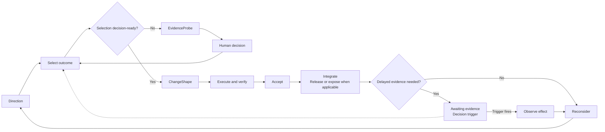

# OutcomeFlow

> An agent-native product delivery framework for selecting, delivering, and learning from independently valuable outcomes.
>
> Version 0.1.0
>
> Status: Draft

OutcomeFlow helps one person acting as product owner and developer decide what should become true next, deliver it with AI assistance, and reconsider direction using observed evidence.

OutcomeFlow uses [EvidenceProbe](./evidence-probe.md) when consequential uncertainty blocks a decision and [ChangeShape](./change-shape.md) to classify and execute selected outcomes.

## Scope

OutcomeFlow is designed first for one person acting as product owner and developer, working with one primary agent and optional specialist agents.

It coordinates product delivery across one or more repositories. It is not a staffing, budgeting, procurement, or portfolio-governance system.

## Non-Goals

OutcomeFlow is not:

- a comprehensive backlog methodology
- an estimation or resource-utilization system
- a release train or fixed delivery cadence
- a task-decomposition framework
- an agent-orchestration architecture
- a replacement for issue tracking or native operational systems
- a requirement that development be autonomous

## Why OutcomeFlow

Agent assistance can reduce the time required to produce changes. It does not decide which outcomes matter or establish whether an integrated change produced its intended product or operational effect.

OutcomeFlow instead focuses on constraints that can remain scarce:

- product attention and judgment
- human review and integration capacity
- recovery risk and verification difficulty
- test and deployment environment capacity
- external dependencies

Fixed delivery intervals and large task inventories can coordinate human implementation capacity and synchronization. OutcomeFlow instead uses independently valuable outcomes as planning boundaries and observed evidence as input to the next selection.

## Principles

1. **Select outcomes, not task inventories.** Choose an independently valuable change in product, system, or operational reality.
2. **Keep product authority with the human owner.** Agents may investigate and recommend; the human owner decides priority, meaning, costly-to-reverse choices, and final acceptance.
3. **Limit work by attention.** Set execution concurrency from human review, integration, verification environments, and external dependencies rather than available agent capacity.
4. **Prefer the smallest valuable outcome.** Select the narrowest outcome that can deliver value or useful learning independently.
5. **Probe only consequential uncertainty.** Use EvidenceProbe when a bounded investigation can resolve a decision that blocks responsible selection, shaping, or reconsideration.
6. **Use ChangeShape for execution.** Classify the selected outcome by ambiguity, blast radius, recovery risk, coordination, and verification.
7. **Use decision points, not ceremonies.** Require the decision and its inputs, not a meeting, sprint, or fixed schedule.
8. **Separate delivery from observation.** A delivered outcome may await delayed evidence without blocking independent delivery.
9. **Persist only what must survive.** Keep transient reasoning in the conversation and durable truth in its canonical home.
10. **Keep history in native systems.** Version control, CI, deployment, incident, analytics, and feedback systems retain the operational evidence they own.
11. **Change direction when evidence changes understanding.** Do not preserve a plan after its assumptions stop being useful.

## Operating Question

At each Select decision, ask:

> What is the highest-value outcome we can deliver through verified integration within our current attention and dependency constraints?

## Operating Loop



Completing active delivery for an Outcome is the normal planning boundary. OutcomeFlow does not require sprints or another fixed time interval.

An outcome awaiting evidence is no longer active delivery work. Its trigger can return it for reconsideration while an independent outcome moves through the delivery loop.

EvidenceProbe is an optional decision path, not a stage required for every Outcome. It may also be entered from Escalate or Reconsider and returns control to the blocked human decision.

## Core Concepts

### Direction

Direction is the durable decision context needed to choose between plausible next outcomes.

Keep only:

- the desired product or operational direction
- decision principles and strategic constraints
- deliberate non-goals

Treat Direction as current orientation, not a product-vision template, roadmap, candidate list, or record of temporary priorities. Change it only when product truth or strategy changes.

### Initiative

An Initiative is a temporary strategic bet that may produce several independently valuable outcomes. It connects durable Direction to near-term Outcome selection.

An Initiative is not executable. Do not fully decompose it in advance. Select the next Outcome using current evidence, then reconsider the Initiative after learning from that Outcome.

Not every Outcome requires an Initiative. Maintenance, incidents, obligations, and small improvements may enter the flow directly.

```text
Direction -> optional Initiative -> Outcome

Direction: Make multiplayer effortless for casual groups.
Initiative: Remove friction from joining an existing game.
Outcome: A player can join from a shared link without creating an account.
```

### Outcome

An Outcome is an independently valuable and observable change in product, system, or operational reality.

Before selection, understand enough to state:

- what should become true
- why it matters now
- important constraints or non-goals
- how its effect can be observed

Do not turn an Outcome into a speculative task tree.

### EvidenceProbe

Use EvidenceProbe when consequential uncertainty prevents a responsible Select, Escalate, or Reconsider decision and existing evidence is insufficient. It frames one Decision Question, gathers the smallest discriminating evidence, and ends as `decision-ready` or `inconclusive` before returning the choice to the human owner.

Do not use EvidenceProbe for a preference the human owner can answer directly, a conventional reversible implementation, or broad research without a blocked action. EvidenceProbe does not implement production changes.

### ChangeShape

Pass each selected Outcome to ChangeShape. ChangeShape classifies its execution as Direct, Scoped, or Shaped and defines the required coordination and verification.

Treat recovery risk as the difficulty of detecting, containing, reversing, and repairing a failure. It includes time to detection, rollback difficulty, data repairability, compatibility recovery, and lasting consequences.

## Outcome Coordination States

Use only the states needed to coordinate near-term delivery:

- **Candidate:** An Outcome plausible enough to compete for near-term attention. Candidate is a temporary selection state, not a storage class for future ideas.
- **Active:** The selected Outcome currently being shaped, executed, verified, accepted, or integrated. Selection makes an Outcome active.
- **Awaiting evidence:** A delivered Outcome waiting for delayed product or operational evidence. It is no longer active delivery work and does not consume the active Shaped-outcome limit.

After integration, reconsider an Outcome immediately when no delayed evidence is needed. Otherwise keep only its observation condition and Decision Trigger while it awaits evidence.

Remove an Outcome from coordination after reconsideration or a decision to drop it. Preserve history in native systems and retain rationale only when it changes durable truth or records a consequential decision.

### Decision Trigger

A Decision Trigger defines when an Outcome awaiting evidence returns for reconsideration.

A trigger may be:

- a date or elapsed interval
- sufficient usage or sample size
- an external response
- a production, support, or incident signal
- another observable condition

Record the condition, its evidence source, and the decision to reopen. A native system may monitor the trigger, or a person may revisit it manually. Do not imply that an agent will wake automatically unless an actual automation provides that behavior.

## Decision Points

### Select

Apply the Operating Question to the Candidate Outcomes that are plausible enough to compete for near-term attention.

Consider:

- expected value or urgency
- learning value
- risk reduction
- immediate dependencies
- human review and integration capacity
- verification environment availability
- external obligations or blockers

Do not total scores or translate these considerations into effort estimates. The human owner makes the final selection.

When consequential uncertainty materially affects Outcome selection, use EvidenceProbe before selection. Resume Select after the human owner makes the blocked decision or explicitly accepts an inconclusive result and its consequence.

### Shape

Use ChangeShape to classify the selected Outcome and establish its execution, coordination, and verification requirements.

If shaping exposes a consequential decision that existing evidence cannot support, pause implementation and use EvidenceProbe. Resume ChangeShape after the human owner decides.

### Escalate

Pause when additional evidence changes product meaning, ownership, recovery risk, dependencies, scope, or required verification.

Reclassify through ChangeShape or return the decision to the human owner before expanding or integrating the work.

Use EvidenceProbe when a bounded investigation can resolve the uncertainty. Do not invoke it when the owner can decide directly or no practical Probe can change the action.

### Accept

Accept an implementation only when the ChangeShape verification contract is satisfied or the human owner explicitly accepts a named failure or residual risk.

Acceptance establishes that the implementation is sufficiently verified for integration. It does not prove that the integrated Outcome will produce its expected delayed effect. Acceptance permits integration and does not relabel failed or unverified evidence as verified.

### Integrate

Place the accepted change into its owning code, configuration, or product system.

Deployment, publication, release, and exposure remain in their applicable native systems. Perform them when required for the Outcome to produce an observable effect. OutcomeFlow does not assume continuous deployment or require a separate release ceremony.

### Observe

Verification establishes that the change behaves as intended. Observation establishes whether the intended change produced the expected product or operational effect.

Observation may use:

- direct product use
- user or stakeholder feedback
- operational behavior
- support or incident signals
- an agreed product measure
- a Decision Trigger and its evidence source

Do not require a metric or observation report for every Outcome. When verification fully establishes the intended effect and no delayed result is relevant, proceed directly to Reconsider.

### Reconsider

Use available evidence to decide whether to:

- continue the Initiative
- reshape a Candidate Outcome
- change a constraint or assumption
- stop the Initiative
- select a different Outcome

When a Decision Trigger fires, return the awaiting Outcome for this decision. Do not create a retrospective or learning document by default. Update durable material only when understanding changed.

Use EvidenceProbe when reconsideration depends on a consequential question that the available observation cannot answer responsibly.

## Attention and Ownership

Keep at most one active Shaped Outcome across an integration owner's current ownership domain, including all repositories involved. Local safety or release constraints may impose a stricter limit.

ChangeShape separately limits each repository to one active Shaped Outcome. When OutcomeFlow uses ChangeShape, both constraints apply.

OutcomeFlow distinguishes two forms of concurrency:

- **Execution concurrency** consumes human review and integration attention and remains deliberately constrained.
- **Observation concurrency** lets delivered Outcomes wait passively for evidence. An Outcome awaiting evidence does not consume the active Shaped-outcome limit, but it must retain a live Decision Trigger.

Direct or Scoped work may interrupt active Shaped delivery only when the interruption is inexpensive and does not displace review, integration, or product attention.

Unused agent capacity is not a reason to start more work. Use additional agents only for independent research, review, verification, or non-overlapping implementation when the owner can evaluate and integrate the results.

For every agent, define the Outcome, scope, exclusions, acceptance, verification, and mutation authority. Keep priority and final acceptance with the human owner.

## Dependencies and Boundaries

Record only dependencies that affect selection, sequencing, ownership, or acceptance. Do not create a complete dependency graph by default.

Treat a change spanning several repositories as one Outcome when its value or acceptance depends on their combined behavior. Assign one integration owner and verify the cross-repository boundary as part of the selected Outcome.

Split unrelated Outcomes. Do not group them only because they share a repository, release, or available agent.

## Information Model

### Canonical State

Canonical State describes current Direction, constraints, architecture, and operating truth. Update it only when that truth changes.

### Coordination State

Coordination State contains the Active Outcome, immediate Candidates, Outcomes awaiting evidence with live Decision Triggers, unresolved decisions, active EvidenceProbe boundaries when they must survive the interaction, and current dependencies.

Keep this state only when it must survive the current interaction. Use one existing coordination system rather than creating a parallel authority.

### Operational State

Code belongs in version control. Checks belong in CI or the relevant verification system. Releases and deployments belong in their owning systems. Incidents belong in incident systems. Product signals belong in their owning analytics or feedback systems.

Do not duplicate Operational State in planning documents.

## Minimal Coordination

When persistent coordination is necessary, retain only:

- one active Shaped Outcome
- at most two or three deliberate Candidate Outcomes
- Outcomes awaiting evidence only while they retain an observation condition, evidence source, and live Decision Trigger
- one active EvidenceProbe Decision Question only when it blocks the current selection, shaping, or reconsideration decision and must survive the interaction
- links to any temporary ChangeShape specification

Do not maintain a comprehensive backlog, progress journal, learning ledger, agent report archive, dependency inventory, completed-outcome archive, or parallel project-management database.

## Relationship to Supporting Methods

OutcomeFlow, EvidenceProbe, and ChangeShape are independently versioned. OutcomeFlow 0.1.0 is aligned with EvidenceProbe 0.1.0 and ChangeShape 1.1.0.

| Layer or method | Owns                                                                                  | Primary question                                                                              |
| --------------- | ------------------------------------------------------------------------------------- | --------------------------------------------------------------------------------------------- |
| OutcomeFlow     | Direction, Initiatives, selection, attention, delayed evidence, and Decision Triggers | What should become true next, what evidence is pending, and when should the owner reconsider? |
| EvidenceProbe   | Decision framing, discriminating evidence, and residual uncertainty                   | What evidence is sufficient for this consequential decision?                                  |
| ChangeShape     | Classification, execution, coordination, verification, and acceptance                 | What kind of change is this, and what evidence does acceptance require?                       |
| Native systems  | Code, checks, releases, deployments, analytics, incidents, and feedback               | What actually happened?                                                                       |

OutcomeFlow supplies EvidenceProbe with the blocked decision, why it matters, relevant constraints, the human owner, and the action awaiting the result.

EvidenceProbe returns `decision-ready` or `inconclusive` evidence, material residual uncertainty, and the explicit choice left with the human owner. It does not return production implementation.

OutcomeFlow supplies ChangeShape with the selected Outcome, why it matters now, product constraints and non-goals, the human owner, and the intended observable effect.

ChangeShape returns the execution classification, coordination and verification requirements, reported verification state, and any named failure or residual risk.

ChangeShape establishes whether the implementation is sufficiently verified and accepted for integration. OutcomeFlow later determines whether the accepted change produced its intended product or operational effect.

ChangeShape remains usable without OutcomeFlow and retains its own minimal Initiative and Candidate guidance for standalone adoption.

EvidenceProbe also remains usable independently. Use `$run-evidence-probe` to resolve one consequential uncertainty without adopting OutcomeFlow.

Use `$adopt-outcome-flow` to audit or adapt the framework and its supporting-method routing to existing project conventions. The adoption skill reuses compatible local behavior and does not require fixed filenames, duplicate a current ChangeShape classifier, or require EvidenceProbe for routine decisions.

## Lifecycle

1. Review current Direction and constraints.
2. Identify or reconsider at most two or three Candidate Outcomes.
3. When consequential uncertainty blocks selection, use EvidenceProbe and return the result to the human owner.
4. Select one independently valuable Outcome and make it Active.
5. Delegate execution treatment to ChangeShape, using EvidenceProbe if a consequential decision later blocks safe shaping.
6. Execute, verify, accept, and integrate the Outcome.
7. Release, deploy, publish, or expose it through the owning native system when applicable.
8. Reconsider immediately when no delayed evidence is needed.
9. Otherwise mark the Outcome as Awaiting evidence with an observation condition, evidence source, and Decision Trigger.
10. Select another independent Outcome while evidence is pending.
11. When the trigger fires, observe the effect and Reconsider the awaiting Outcome. Use EvidenceProbe only if another consequential uncertainty blocks the decision.
12. Update durable truth only when understanding changed, then remove completed temporary coordination.
