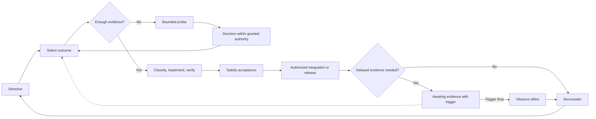

# OutcomeFlow Examples

Read the [operating contract](../outcome-flow.md) for requirements. This document illustrates the relationships between selection, delivery, and observation.

## Delivery Flow

## Direction and Outcomes

- Direction: Make multiplayer effortless for casual groups.
- Optional Initiative: Remove friction from joining a game.
- Outcome: A player can join from a shared link without creating an account.

The owner may select that outcome directly. The agent does not need to construct an Initiative or ask for selection again.

A first outcome might let a host invite a player into an existing session end to end, without adding an invitation dashboard or persistent social graph. An unused invitation table alone would not deliver that value. Required access controls and join validation remain part of the outcome, not optional scope to cut.

## Delayed Evidence

A verified onboarding change may be delivered before enough users have tried it to assess completion rates. Keep the evidence source, observation condition, and decision to revisit. Another independent outcome can proceed while that evidence is pending.

A copy correction whose effect is established by direct inspection usually needs no delayed observation. Avoid creating metrics or a report solely to fill a workflow stage.

## Reconsideration

If shared-link joining works technically but observed failures cluster around expired links, the owner may reshape the next candidate around recovery messaging instead of building more invitation features. If evidence supports continued investment, select the next independently valuable outcome. If it undermines the Initiative's premise, the owner may change the assumption, stop the Initiative, or choose another outcome; sunk implementation work does not require continuing the plan.

## Ownership

OutcomeFlow owns direction, selection, attention, and delayed observation. ChangeShape owns implementation classification and verification. EvidenceProbe owns bounded evidence gathering. Native systems own code, checks, deployments, incidents, and product signals.

## Changelog

Each entry lists behavior an adopted copy may need to change. Upgrade by applying every entry after the recorded version.

### 1.1.2

- Repair the incomplete 1.1.0 upgrade entry; the operating contract is unchanged. Ensure execution receives what should become true, why it matters now, constraints and non-goals, decision authority, and the intended observable effect. Derive acceptance conditions from effects implementation can demonstrate; leave effects that only delayed use can show to observation.

### 1.1.1

- Removed the supporting-method version alignment line; no behavior change.

### 1.1.0

- Review live Decision Triggers before selecting the next outcome; a met trigger can reopen its decision ahead of new candidates.
- An explicit flow runs from selection through execution, delivery, and observation to reconsideration, which updates Direction only when understanding changed.
- Execution receives what should become true, why it matters now, constraints and non-goals, decision authority, and the intended observable effect. It derives acceptance conditions from effects implementation can demonstrate and leaves effects that only delayed use can show to observation. It returns classification, evidence states, accepted or unresolved risks, and what was integrated or still awaits authorization. An outcome stays active until the integration or release that lets its effect occur is complete.
- Restored from 0.1.0:
  - Initiatives are not decomposed in advance. Their next outcome is selected from current evidence, and the Initiative is reconsidered after each outcome. Outcomes do not become speculative task trees.
  - Trigger examples are listed.
  - Local safety or release constraints may tighten concurrency.
  - One integration owner verifies a cross-repository boundary.
  - Unrelated outcomes stay split even when they share a repository, release, or agent.

### 1.0.0

- Initial release.
